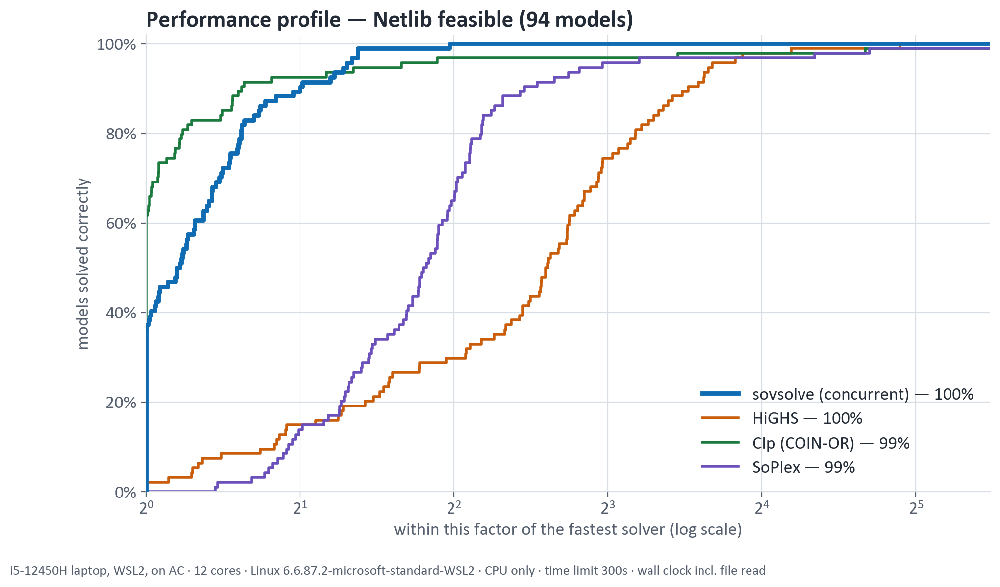

# SovSolve

**An optimisation solver for linear, mixed-integer and quadratic programs,
written from scratch in C++20 and CUDA.**
Smart India Hackathon 2026 · Problem Statement **26119** (MRPL) · Team **SovSolver** (ID 148792)

SovSolve reads a model from a standard file, runs four solver engines at
once on separate CPU cores, keeps the first answer that is *proved*, and
reports it in the model's own variables together with the evidence: dual
values for an optimum, a Farkas certificate and the conflicting constraints
for an infeasible model, an improving ray for an unbounded one. No
open-source or commercial optimisation solver is linked, vendored or called
([details](#the-from-scratch-constraint)).

```text
$ solve examples/refinery.lp
status=Optimal
objective=2.1136513477e+07          <- 211,365.13 per day, the published optimum
...
```

---

## Results at a glance

123 Netlib LPs — the standard public LP test set — on one laptop, CPU only,
300 s limit, best of 3, against the three leading open-source LP solvers run
on the same machine, files and clock ([raw data and method](results/README.md)).

| Solver | Correct verdicts | SGM10, 94 feasible | SGM10, 29 infeasible |
|---|---:|---:|---:|
| **SovSolve** (concurrent) | **123 / 123** | **0.190 s** | **0.032 s** |
| HiGHS 1.15.1 | 123 / 123 | 0.206 s | 0.053 s |
| Clp (COIN-OR) | 121 / 123 | 0.511 s | 1.338 s |
| SoPlex 9.0.0 | 121 / 123 | 0.646 s | 1.288 s |

- **Every verdict correct**: 94 optima within 1e-6 of the reference objective,
  and all 29 infeasible models *proved* infeasible.
- **Faster than HiGHS on 85 of 94** feasible models (median 4.8×), and on
  27 of 29 infeasible ones (median 9.1×). On the 11 hardest models the two are
  level (1.06× HiGHS's time).
- **Large models:** 7 of 10 large LPs from Mittelmann's benchmark (up to
  9.4 M nonzeros) solved to optimality on a cloud A100 server, objectives
  within 2.1e-7 of HiGHS's; the other three reach the 600 s limit
  ([data](results/mittelmann-a100-race.csv)).



*Machine: Intel i5-12450H laptop, WSL2 (Linux 6.6), 12 threads. SGM10 is the
shifted geometric mean of wall time (10 s shift); wall time includes reading
the file, and a wrong or missing answer is charged the full time limit.*

---

## Contents

- [What it solves](#what-it-solves)
- [Quick start](#quick-start)
- [Two worked examples](#two-worked-examples)
- [Which method should I use?](#which-method-should-i-use)
- [How it works](#how-it-works)
- [How the answers are checked](#how-the-answers-are-checked)
- [The from-scratch constraint](#the-from-scratch-constraint)
- [Repository map](#repository-map)
- [References](#references)

---

## What it solves

| Problem | How | Status |
|---|---|---|
| **LP** — linear programs | four engines raced by default; each also runs alone | complete, benchmarked above |
| **MILP** — mixed-integer | branch-and-bound on warm-started dual-simplex nodes, with MIP presolve, cutting planes, reliability branching, conflict analysis and primal heuristics | built; not yet benchmarked on MIPLIB |
| **QP** — convex quadratic | primal-dual interior point on the GPU (CUDA builds) | solves small models in the test suite; not yet benchmarked at scale |

**Input formats:** MPS (fixed and free), CPLEX LP, QPLIB; `.mps.gz` when zlib
is present. Names, bounds, ranges and integrality are kept exactly.

**The engines**

| `--method=` | Algorithm | Runs on | Good for |
|---|---|---|---|
| `concurrent` *(default)* | races the four engines below on separate cores; the first proven verdict wins and the rest are stopped | CPU | not having to guess which engine suits the model |
| `dual-simplex` | revised dual simplex: LU factorisation, dual steepest edge, bound flipping, cost perturbation | CPU | exact vertex solutions; the engine behind branch-and-bound |
| `primal-simplex` | revised primal simplex on the same LU machinery | CPU | models where the dual stalls; finishing a dual run |
| `hsd` | homogeneous self-dual interior point | CPU | proves infeasibility and unboundedness by construction |
| `pdlpx` | cuPDLPx: restarted Halpern PDHG, first-order, factorisation-free | CPU or GPU | very large LPs, especially on a GPU |
| `pdlp` | PDLP: primal-dual hybrid gradient with adaptive restarts | CPU or GPU | comparison with `pdlpx` |
| `ipm` | primal-dual interior point, Mehrotra predictor-corrector | GPU | convex QP; large LPs on a datacentre GPU |

On the 123 Netlib models the race was won by the dual simplex 63 times, the
interior point 39, the primal simplex 10 and cuPDLPx 2 — no single engine is
best everywhere, which is why racing is the default.

---

## Quick start

### 1. Build and test — CPU only (Windows or Linux)

Needs a C++20 compiler (MSVC, MinGW or GCC), CMake ≥ 3.24 and Ninja.

```sh
cmake --preset release
cmake --build build
ctest --test-dir build --output-on-failure      # 29 test suites
```

The small Netlib models the tests read are committed under `tests/data/`, so
this needs no network.

### 2. With the GPU engines (Linux or WSL2, CUDA toolkit)

```sh
export PATH=/usr/local/cuda/bin:$PATH
cmake --preset cuda
cmake --build build-cuda
ctest --test-dir build-cuda --output-on-failure # 32 test suites
```

A CPU-only build has every engine except the GPU ones and says so plainly if
one is requested. Nothing uses the GPU unless you ask for it.

**Optional libraries** (found automatically; everything works without them):
zlib for `.mps.gz`; SuiteSparse CHOLMOD to factor the CPU interior point's
normal equations (`sudo apt-get install libsuitesparse-dev`); NVIDIA cuDSS for
the same job on the GPU. Without them the in-house sparse LDLᵀ factorisation
is used.

### 3. Solve a model

```sh
./build/tools/solve/solve examples/refinery.lp                   # default: the race
./build/tools/solve/solve model.mps --method=dual-simplex        # one engine; MILP too
./build/tools/solve/solve model.mps --iis                        # explain an infeasible model
./build-cuda/tools/solve/solve big.mps --method=pdlpx --gpu-resident=1
./build/tools/solve/solve                                        # every option and its default
```

Output is one `key=value` line per quantity — status, objective, residuals,
iterations, and the time in each pipeline stage — easy to read and trivial to
parse. On Windows the binary is `solve.exe`.

---

## Two worked examples

Both are in [`examples/`](examples/) and solve in a few milliseconds.

**[`refinery.lp`](examples/refinery.lp)** is the *Refinery Optimisation* model
from H. P. Williams, *Model Building in Mathematical Programming* (5th ed.,
2013): two crudes, distillation, reforming, cracking and blending into five
products under octane and vapour-pressure specifications. SovSolve returns
21,136,513 pence per day — the book's published optimum. The duals also say
what extra capacity is worth: one more barrel a day of distillation adds
£4.47 a day.

**[`refinery_infeasible.lp`](examples/refinery_infeasible.lp)** adds an order
book the plant cannot meet. A bare solver stops at "Infeasible";
`--iis` names the conflict:

```text
$ solve examples/refinery_infeasible.lp --iis
status=Infeasible
iis_quality=Irreducible
iis_row=lube
iis_row=distillation_cap
iis_row=order_jet
...
```

The jet-fuel order, the distillation limit and the lube-oil commitment cannot
all hold; the premium-petrol order is not part of the conflict.

---

## Which method should I use?

| Your model | Use | Why |
|---|---|---|
| Any LP, small to medium | nothing — `concurrent` is the default | the race picks the right engine per model |
| Mixed-integer | `--method=dual-simplex` | runs branch-and-bound |
| Very large LP, GPU available | `--method=pdlpx --gpu-resident=1` | matrix-free; the whole iteration stays on the GPU as CUDA graphs |
| Very large LP, CPU only | `--method=pdlpx` | the same algorithm on the CPU |
| Convex QP | `--method=ipm` (CUDA build) | the interior point handles the quadratic term |
| An infeasible model you need explained | add `--iis` | prints an irreducible set of conflicting rows and bounds |
| The same exact vertex on every run | add `--concurrent-crossover=1` | when cuPDLPx or the interior point wins, the simplex finishes its answer at a vertex; about 2× slower where it runs, so off by default |

---

## How it works

Every engine sits in the middle of the same pipeline, so every engine reports
answers in the same form.

```text
 model file ─► parse ─► canonicalise ─► presolve ─► scale ─► ENGINE(S) ─► undo scaling,
 (MPS / LP /   (keeps     (one standard   (remove     (geometric          presolve and
  QPLIB)       what the    form; every     redundant   or Ruiz)            canonical form
               file said)  step recorded   rows and                     ─► answer in the
                           so it can be    columns)                        model's own terms
                           undone)
```

- **Two models, not one.** The parser keeps exactly what the file said; a
  separate canonicaliser converts it to the solver's standard form and
  records every step, so the answer — including duals and ranged rows — is
  reconstructed exactly.
- **Bounds stay bounds.** Variable bounds are never turned into extra rows,
  which would have grown some models by over 700%. The mathematics is written
  down once, in [`docs/FORMULATION.md`](docs/FORMULATION.md).
- **Answers are measured on the original model.** For every engine, `solve`
  recomputes the row violation, the reduced-cost residual and the duality gap
  from the returned solution alone, and prints them
  (`original_primal_residual`, `original_dual_residual`, `original_gap`). The
  GPU interior point refuses to report `Optimal` unless all three are within
  1e-6.
- **Deterministic.** GPU reductions use a fixed summation order, so a GPU run
  reproduces bit for bit and takes the same iterations as the CPU run.
- **Constants are cited.** Each tuning constant is either taken from a
  published paper or measured here and labelled as such; the register is
  [`docs/TUNABLES.md`](docs/TUNABLES.md).

---

## How the answers are checked

- **Against other solvers.** `scripts/bench_suite.py` runs HiGHS, SoPlex and
  Clp as separate programs on the same files and scores every answer (table
  above); a fast wrong answer counts as wrong.
- **The file reader against published optima.** `scripts/oracle_check.py`
  hands the model *as we parsed it* to an independent solver (HiGHS, through
  SciPy) and compares the optimum with the value Netlib publishes, so a
  misread bound or sign shows up as a wrong number.
- **Engines against each other.** First-order and interior-point engines are
  tested against the simplex's exact answer, and the race against each engine
  run alone — racing may change how fast the answer comes and which engine
  gives it, never the verdict; objectives agree to within the engines'
  stopping tolerance (1e-8 relative).
- **Against brute force.** Branch-and-bound is tested against exhaustive
  enumeration, for every branching rule.
- **GPU against CPU.** Every GPU operation is tested against its CPU
  counterpart, including CUDA-graph replay for bit-identical results.
- **Fuzzing.** The file readers survived 300,000 mutated inputs without a crash.
- **Architecture.** `scripts/check_layering.py`, run as one of the tests,
  fails if a module includes code from a layer it must not depend on.

---

## The from-scratch constraint

PS 26119 requires that the solver *"shall not be built upon any existing open
source solver library."*

- **No optimisation solver is linked, vendored or called.** Both simplex
  methods, both interior points, PDLP, cuPDLPx, presolve, branch-and-bound and
  the IIS are implemented here from the published algorithms, with the paper
  cited in the code next to what it supports.
- **Linear-algebra libraries are used as building blocks only.** The GPU path
  uses cuSPARSE and cuBLAS for sparse and dense products. CHOLMOD and cuDSS —
  sparse factorisation libraries, not optimisation solvers — are optional
  accelerators for the interior point's normal equations; the in-house sparse
  LDLᵀ does the same job when they are absent, and is the default on the GPU.
- **Other solvers are used only to check answers** — as separate programs in
  the benchmark, and through SciPy in one development test — never linked into
  SovSolve or on its build path. [`docs/HIGHS-COMPARISON.md`](docs/HIGHS-COMPARISON.md)
  explains how the designs differ.
- **No test framework either**: the harness is about 100 hand-written lines
  ([`tests/TestMain.hpp`](tests/TestMain.hpp)).

---

## Repository map

```text
include/sovsolve/     public headers, one folder per layer
  core/               storage: aligned vectors, sparse CSR/CSC matrices
  model/              the model, canonical form, transform stack, all options
  io/                 MPS / LP / QPLIB readers, MPS writer
  solver/             presolve, scaling, every engine, branch-and-bound, IIS
    simplex/          dual and primal revised simplex
    pdlp/             PDLP and cuPDLPx, with CPU and GPU backends
    gpu/              GPU interior point
src/                  implementations, same layout
tools/solve/          the command-line solver
examples/             the refinery models above
tests/                unit, property, corpus and fuzz tests, and their data
scripts/              benchmark, cross-solver comparison, plotting, oracle checks
results/              every published benchmark: CSVs, figures, method
docs/                 design documents (below)
  spec/               module-by-module specification and engineering log
```

### Documentation

| Document | What it covers |
|---|---|
| [`results/README.md`](results/README.md) | The benchmark files, machines, scoring rules and how to reproduce them |
| [`docs/FORMULATION.md`](docs/FORMULATION.md) | The mathematics: canonical form, sign conventions, optimality conditions |
| [`docs/spec/module.txt`](docs/spec/module.txt) | Module-by-module specification and engineering log: what was built, how it was verified, what was measured — dead ends included |
| [`docs/spec/architecture.txt`](docs/spec/architecture.txt), [`docs/spec/datatypes.txt`](docs/spec/datatypes.txt) | Layering, the CPU/GPU boundary, and the core data types |
| [`docs/BENCHMARKING.md`](docs/BENCHMARKING.md) | How to run and read the benchmarks |
| [`docs/TUNABLES.md`](docs/TUNABLES.md) | Every tuning constant, its source paper or measurement, and its flag |
| [`docs/HIGHS-COMPARISON.md`](docs/HIGHS-COMPARISON.md) | How this solver's design differs from HiGHS |
| [`docs/ARCHITECTURE-REVIEW.md`](docs/ARCHITECTURE-REVIEW.md), [`docs/CANONICAL-FORM-ADDENDUM.md`](docs/CANONICAL-FORM-ADDENDUM.md) | The design review before the solver was written, and the canonical-form decision |
| [`docs/SIH-VERSION-PROGRESS.md`](docs/SIH-VERSION-PROGRESS.md) | Version-by-version history: each problem found and how it was fixed |
| [`docs/MPS-FORMAT-NOTES.md`](docs/MPS-FORMAT-NOTES.md), [`docs/LP-FORMAT-NOTES.md`](docs/LP-FORMAT-NOTES.md) | File-format traps that silently produce wrong models, and how each is handled |
| [`docs/DATA-STRUCTURES.md`](docs/DATA-STRUCTURES.md), [`docs/BENCHMARKS.md`](docs/BENCHMARKS.md) | Storage contracts, and the parser's throughput and memory measurements |
| [`docs/REFERENCE.md`](docs/REFERENCE.md) | Full bibliography |
| [`docs/ENGINEERING-NOTES.md`](docs/ENGINEERING-NOTES.md) | The earlier README: detailed build notes and the ingestion layer's design record |

---

## References

The main sources, as cited in the code; the full list is in
[`docs/REFERENCE.md`](docs/REFERENCE.md).

- A. Koberstein, *The Dual Simplex Method, Techniques for a Fast and Stable
  Implementation*, PhD thesis, 2005.
- E. D. Andersen, K. D. Andersen, *The MOSEK interior point optimizer for
  linear programming: an implementation of the homogeneous algorithm*, 2000.
- S. Mehrotra, *On the implementation of a primal-dual interior point
  method*, SIAM J. Optimization, 1992.
- D. Applegate et al., *Practical Large-Scale Linear Programming using
  Primal-Dual Hybrid Gradient*, NeurIPS 2021 — PDLP.
- H. Lu, Z. Peng, J. Yang, *cuPDLPx: A Further Enhanced GPU-Based First-Order
  Solver for Linear Programming*, arXiv 2507.14051.
- H. Lu, J. Yang, *Restarted Halpern PDHG for Linear Programming*,
  arXiv 2407.16144.
- K. Chen et al., *HPR-LP: An implementation of an HPR method for solving
  linear programming*, arXiv 2408.12179.
- T. Achterberg, *Constraint Integer Programming*, PhD thesis, 2007 —
  branch-and-bound, propagation, conflict analysis, presolve.
- T. Achterberg, R. Bixby, Z. Gu, E. Rothberg, D. Weninger, *Presolve
  Reductions in Mixed Integer Programming*, INFORMS J. Computing, 2020.
- J. Gleeson, J. Ryan, *Identifying Minimally Infeasible Subsystems of
  Inequalities*, ORSA J. Computing, 1990 — the IIS.
- H. P. Williams, *Model Building in Mathematical Programming*, 5th ed.,
  Wiley, 2013 — the refinery example.
